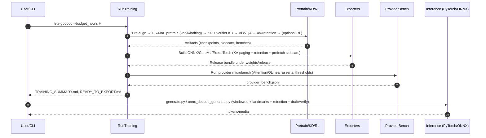

### Core ML provider routing and device support matrix (decode-step)

We export a decode-step MLProgram with KV streaming and embed metadata (rope_base/scale, heads, layers, kv_latent_dim). The Core ML fused ops namespace `omnicoder_coreml::mla` is registered as a Composite fallback; native MIL-backed mapping can override this.

Planned/partially supported routing (subject to coremltools/iOS versions):

- Attention: map to native Attention when converter supports it; otherwise SDPA in MLProgram.
- MatMul (INT4/QLinearMatMul): prefer QLinearMatMul via MLProgram/QNNPack when available; otherwise float matmul.

Device support matrix (indicative; depends on iOS/hardware/toolchains):

- iPhone 16 (A18): MLProgram, native Attention on current coremltools; 8‑bit weight linear matmul (QLinearMatMul) achievable via post-conversion quant.
- iPhone 15 (A17): MLProgram, mixed-precision matmuls; native Attention available in recent toolchains; QLinearMatMul may require specific converter versions.
- iPhone 13/14 (A15/A16): MLProgram with fp16/fp32 matmul; fused ops may partially fall back to CPU depending on iOS version.
- iPad M1/M2/M4: High throughput MLProgram; native Attention support varies; QLinearMatMul supported via converter quantization.

Provider microbench canaries record tokens/s per provider; thresholds are enforced during export/bench flows and can be tuned in `profiles/provider_thresholds.json`.

### KV paging sidecar schema

Decode-step ONNX exports may be accompanied by a `*.kv_paging.json` sidecar to guide runtime paging:

- `page_len` (int): number of tokens per page for past K/V.
- `n_layers` (int): number of transformer layers.
- `heads` or `heads_per_layer` (int|list[int]): number of attention heads (global or per-layer).
- `dl` or `dl_per_layer` (int|list[int]): latent KV dimension (global or per-layer).
- `spill_bytes` (optional int): bytes expected to spill to flash/disk for KV pages beyond RAM budget (for budgeting tools).

Runtimes (`onnx_decode_generate.py`) honor this schema to materialize only the tail window and (optionally) predicted pages, and tools (`kv_budget_enforce.py`, `mobile_budget_check.py`) use the per-layer fields and `spill_bytes` to estimate KV memory.

# Architecture (Concise)

## Overview
This document outlines the major components of OmniCoder and how they interact for on-device multimodal generation.

## Core model
- Sparse MoE Transformer (`src/omnicoder/modeling/transformer_moe.py`) with:
  - MoE routing blend during training: TopK + MultiHead + GRIN combined via a learned blend, evaluated as classic TopK for stability.
  - Hierarchical routing (`HierarchicalRouter`) with group masking and optional conditioning from `PreAligner` embeddings (text/image/audio/video) to bias expert selection.
  - KV‑compressed attention via `LatentKVAttention` (latent projection of K/V) and windowed decode support with landmark/random‑access tokens.
  - Learned retention head providing per‑token keep/compress/drop preferences; sidecars consumed by runners and exports.
  - Multi‑Token Prediction (MTP) heads and a lightweight verifier head for speculative decoding (block verify and tree search supported in generator and ONNX runner).
  - Optional HRM (Hierarchical Reasoning Module) enabled by default with adaptive halting.

## Multimodal IO
- Text, image, video, and audio adapters with unified vocab slices and optional continuous latent heads.
- `PreAligner` projects modality embeddings into a shared normalized concept space; the model’s `ConceptLatentHead` participates in training and inference routing bias.
- Continuous latents for image/audio with optional tiny refiner ONNX exports; gating by CLIPScore/FID/FAD hooks where enabled.
- Cross‑modal verifier (mini‑CLIP): tiny `CrossModalVerifier` scores alignment between normalized `PreAligner` embeddings; can be used for rejection sampling in image/video paths.

### Video‑augmented fused pretraining
- Optional `vl_video_fused_pretrain` stage integrates video sequences alongside VL JSONL to align temporal encodings and improve visual grounding across frames.
- Orchestrator toggle: `OMNICODER_RUN_VL_VIDEO=1` and `OMNICODER_VIDEO_DATA=/path/to/video_frames`.

### Discrete VQ codebooks (image/video/audio)
- Lightweight VQ codebook training for image (`training/vq_train.py`), video (`training/video_vq_train.py`), and audio (`training/audio_vq_train.py`).
- Improves continuous latent heads by providing discrete priors and optional refiner exports.
- Enabled by `OMNICODER_RUN_VQ=1`; artifacts written under `weights/` and consumed by heads when available.

### Vision encoders

The `VisionBackbone` supports DINOv3 as a first-class option. When `OMNICODER_VISION_BACKEND=dinov3` (default in `.env.example`), the loader attempts to fetch a DINOv3 ViT from torch.hub (`facebookresearch/dinov3`) and exposes a unified `(tokens, pooled)` interface. If DINOv3 is unavailable, it falls back to MobileViT/EfficientViT, SigLIP, or a tiny ViT.

Environment knobs:

- `OMNICODER_VISION_BACKEND=dinov3|auto|timm_vit_tiny|timm_dinov2|siglip`
- `OMNICODER_DINOV3_VARIANT=vit_base14` (or `vit_large14`)
- `OMNICODER_DINOV3_REPO=facebookresearch/dinov3`

### Shared latent alignment (PreAligner/ConceptHead)

The model includes a small `PreAligner` that projects text/image/audio/video teacher features into a shared embedding space used to bias routing and to train a `ConceptLatentHead` on the student. The cross-modal trainer (`training/cross_modal_align.py`) computes InfoNCE losses between the student concept embedding and teacher modality embeddings, plus optional triplet losses with negatives.

With DINOv3 enabled, the vision side uses DINOv3 pooled features as the image teacher by default. Negative prompts (e.g., “no dog present”) are supported for additional triplet constraints.

## Export and runtimes
- Decode-step ONNX with KV I/O, Core ML/ExecuTorch builders, and provider microbench.
  - KV paging and retention/compress sidecars are emitted/consumed.
  - Provider microbench asserts fused Attention and optionally QLinearMatMul (`OMNICODER_REQUIRE_QLINEAR=1`) and records tokens/s by provider; thresholds auto-update from measured metrics when enabled.

## Inference CLI highlights
- Text: `omnicoder.inference.generate`
- Multimodal: `omnicoder.inference.multimodal_infer` for image/video/audio tasks
  - Image/video support cross-modal verifier gating. If `weights/pre_align.pt` exists, its aligner weights are used; else a lightweight default is used.

# Architecture and Details

This document consolidates technical details previously spread through `README.md` and aligns them to the next‑level multimodal MoE roadmap (infinite context, unified continuous latents, frontier‑grade decoding speed, and exportability to mobile within 2–4 GB).

- Core model: `src/omnicoder/modeling/transformer_moe.py`
- Attention + KV: `src/omnicoder/modeling/attention.py`, KV quant in `modeling/quant/`
- Multimodal adapters: `src/omnicoder/modeling/multimodal/`
- Inference CLIs: `src/omnicoder/inference/`
- Exporters: `src/omnicoder/export/`
- Training: `src/omnicoder/training/` (includes GRPO/PPO with programmatic rewards in `training/rl_grpo.py`, `training/ppo_rl.py`)
- Evaluation: `src/omnicoder/eval/`
- Tools/automation: `src/omnicoder/tools/`
  - New: `lets_gooooo` single-button launcher wraps `run_training` (time-budgeted) and optional export-to-phone. Enable auto resource tuning via `OMNICODER_AUTO_RESOURCES=1`.
  - New: `visualize_metrics` → `metrics.svg`/`kv_info.json`, `app_assets` → `dashboard.html`, and `package_app_assets` to copy assets into Android/iOS sample app folders.

Key upgrades planned/partially implemented:
- Gating: hierarchical modality‑aware routing, optional GRIN/multi‑head gating, DeepSeek‑style smaller experts with shared generalists.
- Attention/memory: Multi‑Head Latent Attention (KV compression) + sliding window; recurrent memory slots; optional compressive memory head; SSM interleaves for linear‑time mixing in full‑sequence passes.
- Landmarks/random‑access: landmark tokens enable random access within windowed decode; prefix hidden states seed landmark summaries for jumps.
- Infinite context: windowed decode + memory priming + retrieval (PQ/kNN‑LM) with bounded KV; ONNX emits 32k/128k decode‑step variants.
- Decoding: multi‑token heads + speculative draft/verify; optional self‑contrast MoE; kNN‑LM blending.
- Quantization: weight‑only 4‑bit, per‑op PTQ, KV u8/NF4 per head/group, paged KV with sidecars.
- Multimodal: unified VQ tokenization for image/video/audio; continuous latent heads with optional tiny diffusion refiner; temporal video module.
  - Long‑video continuity: video generator accepts `continue_from` frames to chain segments for long scripts without early termination.
  - Audio–Visual sync: Implemented. `modeling/multimodal/av_sync.AVSyncModule` cross‑attends per‑frame audio and video features, returns fused video features and a scalar alignment score in [0,1]. Training hook integrated in `training/video_temporal_train.py` via `--av_sync` and optional `--audio_dir`/`--av_weight`. Audio quality gates include FAD (reference) and an optional MOS‑proxy in `training/audio_recon.py`.
  - Image/audio continuous latents: per‑patch flow matching in `training/flow_recon.py` via `--patch_loss` and balanced `--flow_weight/--recon_weight`; audio perceptual proxies (Mel/STFT) in `training/audio_recon.py`.
  - Verifier‑head KD: orchestrated in `tools/run_training.py` with `--run_verifier_kd`, producing `weights/omnicoder_verifier_kd.pt` for draft‑and‑verify.
- Providers: fused MLA/MQA backends for DML/Core ML/NNAPI; per‑provider microbench and canaries.
  - Fusion asserts: Attention required by default on mobile/GPU providers; QLinearMatMul can be required with `OMNICODER_REQUIRE_QLINEAR=1`.
  - Profiles can be enriched per device in `profiles/provider_thresholds.json`.

### Status of planned items (implemented here)

- Hierarchical/multi‑head/GRIN routing + DeepSeek‑style experts: implemented in `modeling/routing.py` and wired in `transformer_moe.MoELayer` with optional LLM/interaction routers and paging/prefetch.
- KV compression, windowed decode, landmarks: implemented in `modeling/attention.LatentKVAttention` with `CompressiveKV` and `LandmarkIndexer`; runtime windowing and memory priming in `inference/generate.py` and ONNX runner.
- Infinite context variants and long‑ctx ONNX: `export/onnx_export.py` emits 32k/128k variants with rope scaling hints; Core ML/ExecuTorch builders mirror decode‑step graphs.
- Speculative decoding (MTP + verifier), SCMoE, kNN‑LM: present in `inference/generate.py` with tree search and acceptance heuristics.
- Quantization: int4 weights via `modeling/quant/int4_linear.py`; KV u8/NF4 via `modeling/quant/kv_cache.py`; provider QDQ insertion and maps in exporters.
- Multimodal continuous latents + tiny refiners: continuous heads in `multimodal/aligner.py`; refined variants in `multimodal/latent_refiner.py` (vector/sequence).
- Temporal video module and continuity: `modeling/multimodal/video_pipeline.py` supports `continue_from` frames and optional temporal SSM smoothing.

### End-to-end sequence (high-level)

- Ω‑Reasoner (controller hints): `OmegaController` provides optional decode‑time knobs (block verify size, speculative branches) and acceptance/halting signals; integrates with HRM and early‑exit criteria; controlled via `OMNICODER_REASONER|OMNI_REASONER=omega` and related envs.

See `docs/ProjectPlan.md` for priorities and `todo/` for actionable items.
